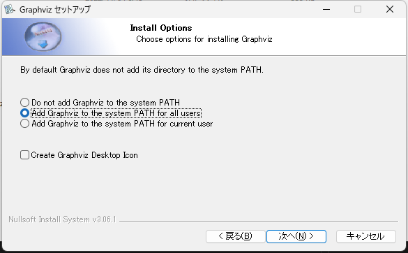

# アーキテクチャ設計書

とりま使うものをめもめも_φ(･_･

- 基本構成
  - Node.js
  - TypeScript
- フロント
  - Angular
- バック
  - Nest JS
  - Prisma
  - Sqlite
- npm
  - Jspreadsheet CE
- 開発環境
  - Visual Studio Code
    - PlantUML `alt + d`
    - Paste Image `ctrl + alt + v`
  - Oracle Java SE
    - Graphviz

## 参考サイト

[開発用ドキュメントの配置 - Qiita](https://qiita.com/hakaicode/items/f4ad5fc45233d24e7961)

[VSCode Markdownに画像をペーストする - Qiita](https://qiita.com/P-man_Brown/items/31a0f1cc8d108b2d88f6#:~:text=Paste%20Image%20%E3%81%AE%E5%88%A9%E7%94%A8%E6%96%B9%E6%B3%95%E3%81%A8%E8%A8%AD%E5%AE%9A&text=%E4%BD%BF%E3%81%84%E6%96%B9%E3%81%AF%E9%9D%9E%E5%B8%B8%E3%81%AB%E7%B0%A1%E5%8D%98,%E7%94%BB%E5%83%8F%E3%82%82%E4%BF%9D%E5%AD%98%E3%81%95%E3%82%8C%E3%81%BE%E3%81%99%E3%80%82)

[Visual Studio Code で UML を描こう！ - Qiita](https://qiita.com/couzie/items/9dedb834c5aff09ea7b2)

Graphviz のインストール時にパスを通す


[Jspreadsheet with Angular](https://bossanova.uk/jspreadsheet/v4/examples/angular)

```shell
cd front
npm install jspreadsheet-ce
npm i --save-dev @types/jspreadsheet-ce
```
