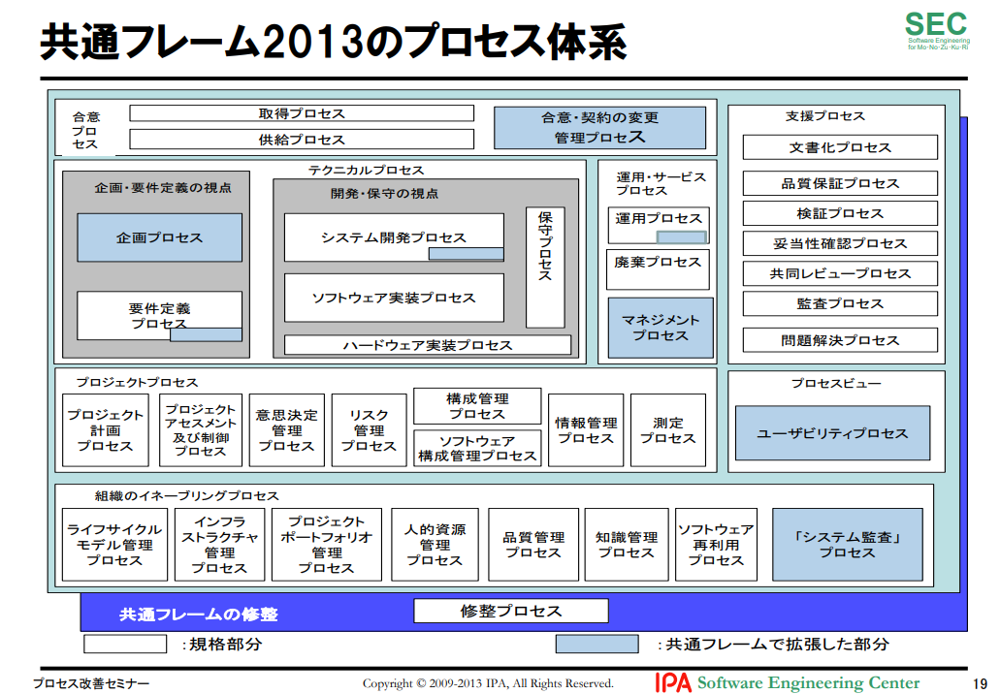

# 要件定義設計書

## スコープ

- テクニカルプロセス
  - システム開発プロセス → インフラTL
  - ソフトウェア実装プロセス → アプリTL
- プロジェクトプロセス
  - プロジェクト計画プロセス → PM
- 支援プロセス
  - 品質保証プロセス → who?
  - 文書化プロセス → who?

### 参考

[【資料公開】チケット駆動開発の解説～タスク管理からプロセス改善へ #redmine: プログラマの思索](https://forza.cocolog-nifty.com/blog/2022/01/post-d7c59a.html)

## 定義

- PM
  - プロジェクトマネージャー
- PL
  - プロジェクトリーダー
- TL
  - チームリーダ
- WK
  - 作業者(ワーカー)
- 工程
  - 管理者 PM
  - 要件定義や内外設計、製造などを指す
- タスク
  - 管理者 PL
  - WBSでの最小単位の作業項目
  - タスクの責務はTL
- チケット
  - 管理者 TL
  - タスクの中で発生するWKに紐づく複数の作業項目
  - チケットの責務はWK(作業者)

## ユースケース

スコープはタスク、実績(日単位)
チケットや実績(時間単位)については後でマージする

